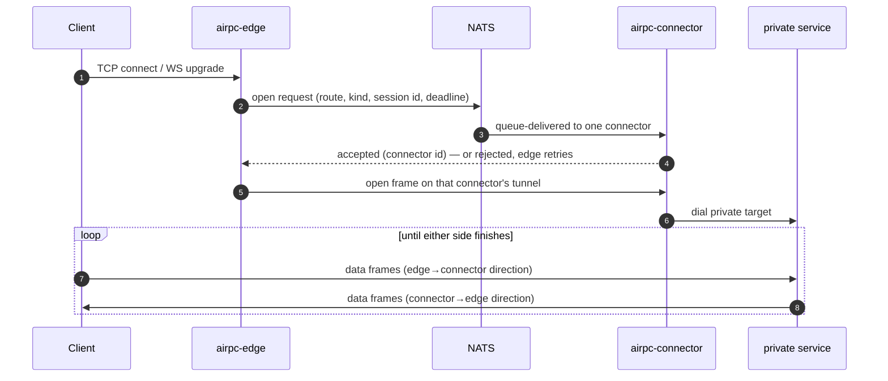

# Architecture

airpc keeps one invariant above everything else: **the private network accepts no inbound connections**. Everything below follows from making that invariant hold while still carrying arbitrary request/response and streaming traffic across the boundary.

## The three components

1. **Edge Gateway (`airpc edge start`)** — runs in the public zone or DMZ. It owns all public listeners: an HTTP listener for `http` and `websocket` routes, one TCP listener per `tcp`/`grpc` route, a data-tunnel listener for connectors, and optionally a metrics listener. It knows route names and public matching rules, but has no private addresses, credentials, or reachability.
2. **Private Connector (`airpc connector start --id <id>`)** — runs next to the private services. It knows the private targets. It dials **out** to NATS and **out** to the edge's data listener, and nothing ever dials it. Multiple connectors with the same config form a load-balanced pool.
3. **NATS broker** — the control plane. It carries small MessagePack envelopes: HTTP unary requests/responses that fit inline, stream-open negotiations, and cancellation signals. Bulk bytes never traverse NATS (its payload ceiling and persistence semantics make it the wrong tool for that — the same reasoning air3 applies to object bytes).

airpc is the sibling of [air3](https://github.com/terion-name/air3), which implements this exact trust split for S3 objects: edge validates public requests, connector holds private credentials, NATS carries tickets, data moves on a connector-initiated stream. airpc generalizes the pattern from files to RPC calls and sockets.

## Control plane: NATS subjects

All subjects are versioned and derived from the route name:

| Subject                              | Direction            | Purpose                                        |
| ------------------------------------ | -------------------- | ---------------------------------------------- |
| `airpc.v1.route.<route>.unary`       | edge → connector     | HTTP unary request envelope (request/reply)    |
| `airpc.v1.route.<route>.open`        | edge → connector     | Select a connector for a stream session        |
| `airpc.v1.cancel.<request_id>`       | edge → all connectors| Abort an in-flight HTTP request                |

Connectors subscribe with queue group `airpc.route.<route>.connectors`, so NATS delivers each request or open to exactly one member of the pool. Scaling out is just starting more connectors. "No connector running" maps to fast failures at the edge (`503` for HTTP), courtesy of NATS no-responder replies.

Route names are strict tokens (`[A-Za-z0-9_-]`, max 128 chars) and are validated on both ends, so route names can never smuggle NATS wildcards or subject separators.

## Data plane: the connector-owned tunnel

Each connector maintains **one outbound WebSocket** to the edge's `data_addr` at `/_airpc/data?connector_id=<id>`, authenticated by the shared `tunnel_token` (query param or `Authorization: Bearer`) and/or an mTLS client certificate. All stream traffic for that connector — TCP, gRPC, WebSocket relays, and streamed HTTP response bodies — is multiplexed over this single connection as MessagePack frames keyed by `session_id`:

| Frame    | Meaning                                                             |
| -------- | ------------------------------------------------------------------- |
| `open`   | Start a session (route, kind, optional path)                        |
| `data`   | One chunk (≤ 32 KiB) of binary data or one WebSocket message        |
| `window` | Flow-control credit returned by the receiver                        |
| `eof`    | Half-close: no more data in this direction                          |
| `close`  | Session over (optionally carrying a WebSocket close code and text)  |
| `error`  | Session aborted with a reason                                       |

### Session lifecycle

For a public TCP/gRPC/WebSocket connection:

If the connector that wins the queue draw reports its tunnel is down, the edge retries the open every 50 ms (until the route `timeout`), so a healthy connector in the pool picks the session up.

### Flow control — why one slow client can't hurt the others

The tunnel is shared, so fairness is enforced per session: each side may have at most **32 unacknowledged data frames** (~1 MiB at the 32 KiB chunk size) in flight per session. The receiver returns credit with `window` frames as it writes data out. A session whose consumer stalls simply runs out of credit and pauses — backpressure propagates cleanly to the origin socket — while every other session on the same tunnel keeps flowing. Frames are never dropped; a peer that overruns its window is treated as protocol-violating and its session is killed.

### Faithful stream semantics

- **TCP half-close:** a `FIN` on either side becomes an `eof` frame and half-closes the other side, so request → half-close → response protocols work; the session ends when both directions have finished.
- **WebSocket close codes:** a close initiated by either end is relayed with its original status code and text, so both sides complete their close handshakes normally. Ping/pong keepalives are answered hop-by-hop and are not relayed.
- **gRPC:** carried as an opaque HTTP/2 byte stream — trailers, `*-bin` metadata, `grpc-timeout`, RST_STREAM cancellation, and all four streaming shapes pass through untouched. This is deliberate: re-terminating gRPC is where proxies break in subtle ways. Protocol awareness is observation-only (see below).
- **Idle timeout:** routes may set `idle_timeout`; a session with no relayed data in either direction for that long is torn down. Disabled by default because WS ping/pong does not count as activity.

## HTTP path: inline fast path, streamed slow path

HTTP unary requests are the one flow that rides NATS end-to-end when possible:

1. The edge matches the route (`public_host`, then longest `public_prefix` / exact `public_path`), reads the request body up to `max_inline_request`, filters headers to the `forwarded_headers` allowlist (hop-by-hop headers always stripped), and sends one envelope with `nc.Request()`.
2. The connector rebuilds the request against the private `target`, honoring the deadline.
3. If the response fits (`Content-Length` ≤ `max_inline_response` and not an event stream), it returns inline in the NATS reply. Done — one round trip.
4. If the response is **chunked, SSE, or oversized**, the connector instead opens an `http-stream` session on its data tunnel, replies over NATS with status + headers + the session reference, and pumps the body through the tunnel. The edge claims the session and flushes chunks to the client as they arrive. Streamed bodies detach from the route `timeout` (which still bounds request dispatch and response headers) and inherit the tunnel's flow control. A truncated stream aborts the client connection rather than faking a clean end.

**Cancellation:** if the public client disconnects or the deadline passes before the reply, the edge publishes `airpc.v1.cancel.<request_id>`; every connector checks it against its in-flight table and aborts the matching backend request. Mid-stream, a client disconnect closes the session, which cancels the backend body read.

## Self-healing

- **Tunnel reconnect:** the connector redials the edge data WebSocket forever, with exponential backoff (250 ms doubling to 5 s, reset after 30 s of stability). While disconnected it *rejects* stream opens over NATS — combined with the edge's open retry, sessions land on connectors that can actually serve them.
- **Edge shutdown closes tunnels explicitly** (HTTP server shutdown does not close hijacked WebSockets), so connectors notice immediately and start redialing.
- **Sessions are not resumed.** A dropped tunnel closes its sessions; clients reconnect and land on a healthy path. State is per-connection only.
- **NATS reconnects are unlimited** after the initial connect (which fails fast so misconfiguration surfaces at startup).

## Security model

- **Zone separation is structural, not configured.** The edge has no private addresses; the connector has no listeners. Compromising the edge yields no credentials for and no route into the private zone.
- **Route allowlist on both sides.** The edge only accepts traffic for configured routes; the connector independently validates every envelope and open against its own config — a compromised edge cannot make a connector dial arbitrary targets.
- **Strict envelope validation.** Every MessagePack envelope (versions, tokens, paths, header values, close codes, windows) is validated on decode *and* encode.
- **Header hygiene.** Only allowlisted request headers cross the boundary; hop-by-hop headers are stripped in both directions.
- **Tunnel authentication.** Shared bearer token and/or mTLS with a private CA (`edge.tls.client_ca_file` + `connector.tls`). Connector IDs are validated tokens.
- **TLS options per surface.** Terminate at the edge (`edge.tls`, `routes[].tls`), or leave TCP routes as passthrough so clients keep end-to-end TLS with certificate pinning.
- **No sensitive logging.** Bodies, Authorization values, and payloads are never logged and never appear in metric labels.

## Observability

Both processes optionally expose Prometheus metrics (`metrics_addr`). Alongside the usual request/session/byte/tunnel counters, `grpc` routes get **passive protocol awareness**: the edge tees the relayed bytes into a bounded queue feeding an HTTP/2 frame + HPACK decoder that extracts `:path`, `grpc-status`, and timing per RPC. The decoder can never block, delay, or modify traffic — if it falls behind or the stream isn't parseable plaintext HTTP/2 (e.g. TLS passthrough), observation goes dark for that connection and the relay is unaffected. See the [observability guide](guides/observability.md).

## Failure modes at a glance

| Failure                          | Client-visible behavior                                                       |
| -------------------------------- | ----------------------------------------------------------------------------- |
| No connector running             | HTTP `503`; TCP/WS connections close after the open times out                 |
| Connector tunnel down            | Opens retried across the pool; if none healthy, fails at route `timeout`      |
| Backend unreachable              | HTTP `502` envelope error; stream sessions close with an error frame          |
| Edge restarts                    | Live sessions drop; connectors redial within ~250 ms; HTTP resumes immediately|
| Deadline exceeded                | HTTP `504`; backend request canceled via the cancel subject                   |
| Response exceeds inline limit    | Streamed through the tunnel; error only if the tunnel is down                 |
